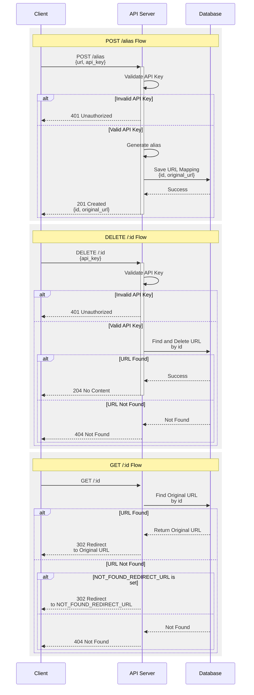

# redirect

A really simple Hono service for URL redirection.

## Overview

This service allows you to alias URLs and redirect to the original URLs using a unique identifier. It's built to be
lightweight and easy to use, while still having most of the features you'd probably want.



### Use cases

You want to share URLs with users, but:

- You don't want to expose lots of parameters in the URL.
- You want to obfuscate the URL.

## Installation

### Requirements

- [Bun](https://bun.sh/) for running and building the server
- [Upstash](https://upstash.com/) for Redis
- [Unkey](https://unkey.dev/) for API key management (you could easily swap this out for a static API key)
- [Fly.io](https://fly.io/) for deployment (or any other platform)

### Environment variables

See [`.env.example`](.env.example).

## Usage

To start the server, run:

```bash
pnpm dev
```

### Alias a URL

To alias a URL, send a POST request to the `/alias` endpoint with the URL you want to alias in the JSON body.

#### Example Request

```bash
curl -X POST http://localhost:3000/alias \
     -H "Content-Type: application/json" \
     -H "Authorization: Bearer $API_KEY" \
     -d '{"url": "https://gnometeaparty.com"}'
```

#### Example Response

The response will be a JSON object containing:

- `originalUrl`: The original URL you provided.
- `id`: A unique identifier for the alias.

```json
{
  "originalUrl": "https://gnometeaparty.com",
  "id": "tlC6I2rBHpQWGVYld8hp0"
}
```

#### Important Notes

- This route is protected by an API key. It's infeasible to check for accessible routes, since some routes could be
  private. Therefore, an API key is required to prevent abuse. If you don't need this
  (for example, you're trying to create a **public URL shortener**), you can remove the middleware from the
  [route](./src/routes/alias/index.ts).
- IDs are generated using [nanoid](https://github.com/ai/nanoid).
- Each URL is validated to ensure it is valid. Each URL must be from one of the authorized domains.
- Aliases are unique. If the same URL is aliased multiple times, the same alias will be returned.

### Redirect to the Original URL

To redirect to the original URL, make a GET request to the `/:id` endpoint using the unique identifier from the alias.

#### Example Request

```bash
curl http://localhost:3000/tlC6I2rBHpQWGVYld8hp0
```

#### Behavior

- The service will respond with a 302 redirect to the original URL.
- If the URL is not found, the service will respond with a 404 Not Found. If the `NOT_FOUND_REDIRECT_URL` environment
  variable is set, the service will redirect to that URL instead.

## Versioning

This API is versioned using the `X-Api-Version` header. The supported versions will change over time, so please check
the [CHANGELOG.md](./CHANGELOG.md) for the latest version.

## Deployment

```bash
flyctl deploy --remote-only --wait-timeout=500
```

## Additional Information

For any issues or feature requests, please open an issue on the repository.
